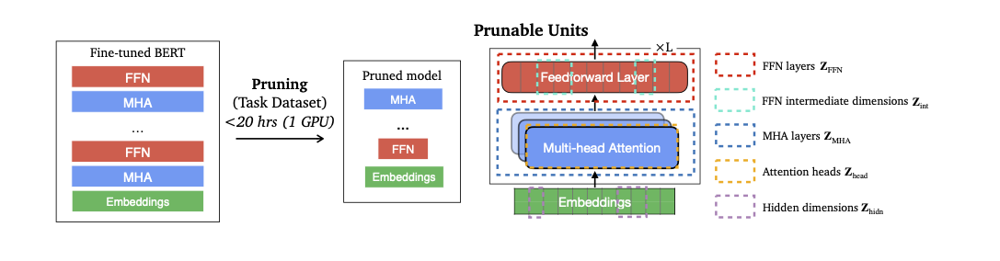
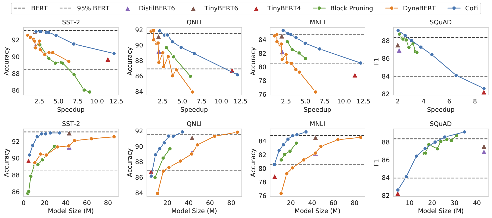

## ☕ CoFiPruning: Structured Pruning Learns Compact and Accurate Models

This repository contains the code and pruned models for our ACL'22 paper [Structured Pruning Learns Compact and Accurate Models](https://arxiv.org/pdf/2204.00408.pdf). Our talk slides can be found [here](https://github.com/princeton-nlp/CoFiPruning/blob/main/ACL2022_talk.pdf).

**************************** **Updates** ****************************

* 05/09/2022: We release the pruned model checkpoints on RTE, MRPC and CoLA!
* 04/01/2022: We released [our paper](https://arxiv.org/pdf/2204.00408.pdf) along with pruned model checkpoints on SQuAD, SST-2, QNLI and MNLI. Check it out!

## Quick Links

- [☕ CoFiPruning: Structured Pruning Learns Compact and Accurate Models](#-cofipruning-structured-pruning-learns-compact-and-accurate-models)
- [Quick Links](#quick-links)
- [Overview](#overview)
- [Main Results](#main-results)
- [Model List](#model-list)
- [Train CoFiPruning](#train-cofipruning)
  - [Requirements](#requirements)
  - [Training](#training)
  - [Evaluation](#evaluation)
- [Bugs or Questions?](#bugs-or-questions)
- [Citation](#citation)

## Overview

We propose CoFiPruning, a task-specific, structured pruning approach (**Co**arse and **Fi**ne-grained Pruning) and show that structured pruning can achieve highly compact subnetworks and obtain large speedups and competitive accuracy as distillation approaches, while requiring much less computation. Our key insight is to jointly prune coarse-grained units (e.g., self-attention or feed-forward layers) and fine-grained units (e.g., heads, hidden dimensions) simultaneously. Different from existing works, our approach controls the pruning decision of every single parameter by multiple masks of different granularity. This is the key to large compression, as it allows the greatest flexibility of pruned structures and eases the optimization compared to only pruning small units. We also devise a layerwise distillation strategy to transfer knowledge from unpruned to pruned models during optimization. 



## Main Results
We show the main results of CoFiPruning along with results of popular pruning and distillation methods including Block Pruning, DynaBERT, DistilBERT and TinyBERT. Please see more detailed results in our paper. 



## Model List

Our released models are listed as following. You can download these models with the following links. We use a batch size of 128 and V100 32GB GPUs for speedup evaluation. We show F1 score for SQuAD and accuracy score for GLUE datasets. `s60` denotes that the sparsity of the model is roughly 60%.
|  model name | task | sparsity | speedup | score |  
|:------|:--------:|:--------:|:-------:|:-----:|
|  [princeton-nlp/CoFi-MNLI-s60](https://huggingface.co/princeton-nlp/CoFi-MNLI-s60) | MNLI |  60.2% | 2.1 ×| 85.3 |  
| [princeton-nlp/CoFi-MNLI-s95](https://huggingface.co/princeton-nlp/CoFi-MNLI-s95) | MNLI  |  94.3% | 12.1 × | 80.6 |  
|  [princeton-nlp/CoFi-QNLI-s60](https://huggingface.co/princeton-nlp/CoFi-QNLI-s60) | QNLI |  60.3% | 2.1 × | 91.8 |  
| [princeton-nlp/CoFi-QNLI-s95](https://huggingface.co/princeton-nlp/CoFi-QNLI-s95) | QNLI  |  94.5% | 12.1 × | 86.1 |  
| [princeton-nlp/CoFi-SST2-s60](https://huggingface.co/princeton-nlp/CoFi-SST2-s60) | SST-2 |  60.1% | 2.1 ×| 93.0 |  
| [princeton-nlp/CoFi-SST2-s95](https://huggingface.co/princeton-nlp/CoFi-SST2-s95) | SST-2  |  94.5% | 12.2 ×| 90.4 |  
|  [princeton-nlp/CoFi-SQuAD-s60](https://huggingface.co/princeton-nlp/CoFi-SQuAD-s60) |  SQuAD |  59.8% | 2.0 ×| 89.1 |  
| [princeton-nlp/CoFi-SQuAD-s93](https://huggingface.co/princeton-nlp/CoFi-SQuAD-s93) | SQuAD  |  92.4% | 8.7 ×| 82.6 |  
| [princeton-nlp/CoFi-RTE-s60](https://huggingface.co/princeton-nlp/CoFi-RTE-s60) | RTE | 60.2% | 2.0 x | 72.6 |
| [princeton-nlp/CoFi-RTE-s96](https://huggingface.co/princeton-nlp/CoFi-RTE-s96) | RTE | 96.2% | 12.8 x | 66.1 |
| [princeton-nlp/CoFi-CoLA-s60](https://huggingface.co/princeton-nlp/CoFi-CoLA-s60) | CoLA | 60.4% | 2.0 x | 60.4 |
| [princeton-nlp/CoFi-CoLA-s95](https://huggingface.co/princeton-nlp/CoFi-CoLA-s95) | CoLA | 95.1% | 12.3 x | 38.9 |
| [princeton-nlp/CoFi-MRPC-s60](https://huggingface.co/princeton-nlp/CoFi-MRPC-s60) | MRPC | 61.5% | 2.0 x | 86.8 |
| [princeton-nlp/CoFi-MRPC-s95](https://huggingface.co/princeton-nlp/CoFi-MRPC-s95) | MRPC | 94.9% | 12.2 x | 83.6 |

You can use these models with the huggingface interface:
```python
from models.modeling_bert import CoFiBertForSequenceClassification import CoFiBertForSequenceClassification
model = CoFiBertForSequenceClassification.from_pretrained("princeton-nlp/CoFi-MNLI-s95") 
output = model(**inputs)
```
 

## Train CoFiPruning

In the following section, we provide instructions on training CoFi with our code.

### Requirements

Try runing the following script to install the dependencies.

```bash
pip install -r requirements.txt
```

### Training

**Training scripts**

We provide example training scripts for training with CoFiPruning with different combination of training units and objectives in `scripts/run_CoFi.sh`. The script only supports single-GPU training and we explain the arguments in following:
- `--task_name`: we support sequence classification tasks and extractive question answer tasks. You can input a glue task name, e.g., `MNLI` or use `--train_file` and `--validation_file` arguments with other tasks (supported by HuggingFace).
- `--ex_name_suffix`: experiment name (for output dir)
- `--ex_cate`: experiment category name (for output dir)
- `--pruning_type`: we support all combinations of the following four types of pruning units. Default pruning type is `structured_heads+structured_mlp+hidden+layer`. Setting it to `None` falls back to standard fine-tuning.
  - `structured_heads`: head pruning
  - `structured_mlp`: mlp intermediate dimension pruning
  - `hidden`: hidden states pruning
  - `layer`: layer pruning
- `--target_sparsity`: target sparsity of the pruned model
- `--distillation_path`: the directory of the teacher model
- `--distillation_layer_loss_alpha`: weight for layer distillation
- `--distillation_ce_loss_alpha`: weight for cross entropy distillation
- `--layer_distill_version`: we recommend using version 4 for small-sized datasets to impose an explicit restriction on layer orders but for relatively larger datasets, version 3 and version 4 do not make much difference.
- `--sparsity_epsilon`: the epsilon to relax the sparsity constraint. If set to be larger than 0, the training process will start saving models with a sparsity `target_sparsity - sparsity_epislon`. This is recommended to be set to be 0.01 when training with 0.95 sparsity to replicate our reported numbers, so that the models with a sparsity above 0.94 will be saved.

After pruning the model, the same script could be used for further fine-tuning the pruned model with following arguments:
- `--pretrained_pruned_model`: directory of the pruned model
- `--learning_rate`: learning rate of the fine-tuning stage
Note that during fine-tuning stage, `pruning_type` should be set to `None`.

An example for training (pruning) is as follows:
```bash
TASK=MNLI
SUFFIX=sparsity0.95
EX_CATE=CoFi
PRUNING_TYPE=structured_heads+structured_mlp+hidden+layer
SPARSITY=0.95
DISTILL_LAYER_LOSS_ALPHA=0.9
DISTILL_CE_LOSS_ALPHA=0.1
LAYER_DISTILL_VERSION=4
SPARSITY_EPSILON=0.01

bash scripts/run_CoFi.sh $TASK $SUFFIX $EX_CATE $PRUNING_TYPE $SPARSITY [DISTILLATION_PATH] $DISTILL_LAYER_LOSS_ALPHA $DISTILL_CE_LOSS_ALPHA $LAYER_DISTILL_VERSION $SPARSITY_EPSILON
```

An example for fine_tuning after pruning is as follows:
```bash
PRUNED_MODEL_PATH=$proj_dir/$TASK/$EX_CATE/${TASK}_${SUFFIX}/best
PRUNING_TYPE=None # Setting the pruning type to be None for standard fine-tuning.
LEARNING_RATE=3e-5

bash scripts/run_CoFi.sh $TASK $SUFFIX $EX_CATE $PRUNING_TYPE $SPARSITY [DISTILLATION_PATH] $DISTILL_LAYER_LOSS_ALPHA $DISTILL_CE_LOSS_ALPHA $LAYER_DISTILL_VERSION $SPARSITY_EPSILON [PRUNED_MODEL_PATH] $LEARNING_RATE
```

The training process will save the model with the best validation accuracy under `$PRUNED_MODEL_PATH/best`. And you can use the `evaluation.py` script for evaluation.


### Evaluation

Our pruned models are served on Huggingface's model hub. You can use the script `evalution.py` to get the sparsity, inference time and development set results of a pruned model.

```bash
python evaluation.py [TASK] [MODEL_NAME_OR_DIR]
```

An example use of evaluating a sentence classification model is as follows:

```bash
python evaluation.py MNLI princeton-nlp/CoFi-MNLI-s95 
```  

The expected output of the model is as follows:

``` 
Task: MNLI
Model path: princeton-nlp/CoFi-MNLI-s95
Model size: 4920106
Sparsity: 0.943
mnli/acc: 0.8055
seconds/example: 0.010151
```

**Hyperparameters**

We use the following hyperparamters for training CoFiPruning:

|               | GLUE (small) | GLUE (large) | SQuAD|
|:--------------|:-----------:|:--------------:|:---------:|
| Batch size    | 32          | 32            | 16       |
| Pruning learning rate  | 2e-5 | 2e-5 | 3e-5 |
| Fine-tuning learning rate |     1e-5, 2e-5, 3e-5      |1e-5, 2e-5, 3e-5|1e-5, 2e-5, 3e-5|
| Layer distill. alpha | 0.9, 0.7, 0.5|0.9, 0.7, 0.5|0.9, 0.7, 0.5|
| Cross entropy distill. alpha | 0.1, 0.3, 0.5|0.1, 0.3, 0.5|0.1, 0.3, 0.5|
| Pruning epochs | 100 | 20 | 20 |
| Pre-finetuning epochs | 4 | 1 | 1 |
| Sparsity warmup epochs | 20 | 2 | 2 |
| Finetuning epochs | 20 | 20 | 20 |

GLUE (small) denotes the GLUE tasks with a relatively smaller size including CoLA, STS-B, MRPC and RTE and GLUE (large) denotes the rest of the GLUE tasks including SST-2, MNLI, QQP and QNLI. Note that hyperparameter search is essential for small-sized datasets but is less important for large-sized datasets. 


## Bugs or Questions?
If you have any questions related to the code or the paper, feel free to email Mengzhou (mengzhou@princeton.edu) and Zexuan (zzhong@princeton.edu). If you encounter any problems when using the code, or want to report a bug, you can open an issue. Please try to specify the problem with details so we can help you better and quicker!

## Citation

Please cite our paper if you use CoFiPruning in your work:

```bibtex
@inproceedings{xia2022structured,
   title={Structured Pruning Learns Compact and Accurate Models},
   author={Xia, Mengzhou and Zhong, Zexuan and Chen, Danqi},
   booktitle={Association for Computational Linguistics (ACL)},
   year={2022}
}
```
